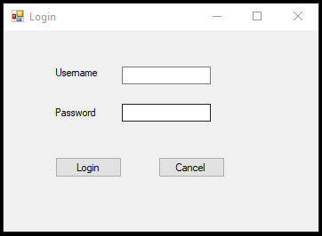
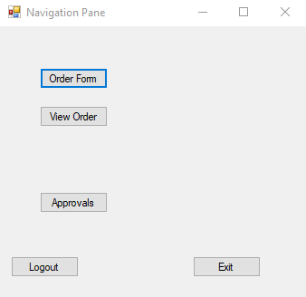
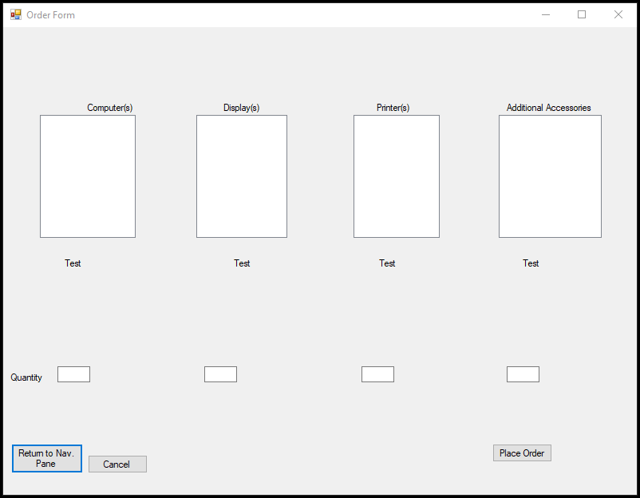
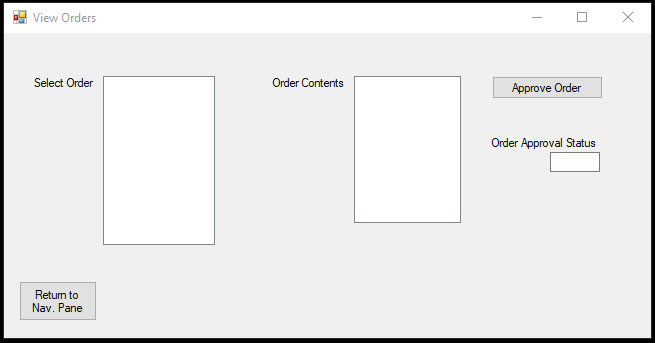
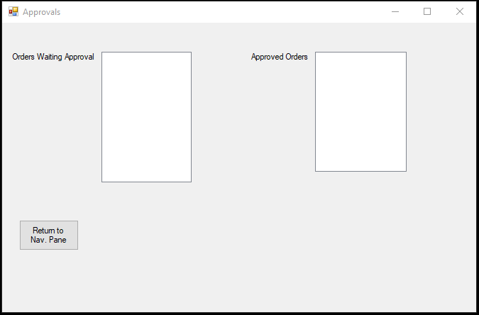

# 🖥️ Koch IT Purchase Order Management System

    

A Visual Basic .NET desktop application developed as part of a capstone project for Koch Inc. to streamline IT equipment purchase requests, approvals, and fulfillment workflows.

---

## 📋 Overview

This application was designed to automate the lifecycle of IT purchase orders within an organization.

Employees can submit requests for hardware and accessories, managers can review and approve requests, and users can track order status throughout the approval process.

The system was built using Visual Basic .NET, Windows Forms, and Azure SQL Database technologies.

---

## ✨ Features

### 🔐 User Authentication

* Secure employee login
* User access control

### 📝 Purchase Order Creation

* Request Computers
* Request Displays/Monitors
* Request Printers
* Request Additional Accessories
* Specify item quantities

### 📦 Order Management

* View submitted orders
* Review order contents
* Track order approval status

### ✅ Approval Workflow

* Review pending purchase requests
* Approve or reject orders
* Maintain approved order history

### 📧 Automated Notifications

* Email notifications sent throughout the workflow
* Status updates provided to stakeholders

---

## 📸 Screenshots

### 🔐 Login Screen



Secure user login interface.

---

### 🧭 Navigation Dashboard



Central navigation hub for accessing application features.

---

### 📝 Order Form



Submit IT equipment requests including computers, monitors, printers, and accessories.

---

### 📦 View Orders



Review submitted orders and monitor approval status.

---

### ✅ Approvals Screen



Approve requests and manage order workflow.

---

## 🛠️ Technologies Used

| Technology          | Purpose                 |
| ------------------- | ----------------------- |
| Visual Basic .NET   | Application Development |
| Windows Forms       | User Interface          |
| Visual Studio       | Development Environment |
| Azure SQL Database  | Data Storage            |
| SQL                 | Database Queries        |
| SMTP Email Services | Notifications           |

---

## 🗄️ Database Notice

This project originally connected to an Azure SQL Database used during the capstone engagement.

The original database schema and data are not included in this repository and are no longer accessible.

As a result, some functionality requiring database connectivity cannot be fully demonstrated. The application source code, user interface, and workflow implementation remain available for educational and portfolio purposes.

---

## 📂 Repository Structure

```text
Koch-IT-Purchase-Order-Management-System/
│
├── README.md
├── LICENSE
├── App.config
├── Capstone.vbproj
│
├── Forms/
│   ├── Login.vb
│   ├── Login.Designer.vb
│   ├── Login.resx
│   │
│   ├── NavigationPane.vb
│   ├── NavigationPane.Designer.vb
│   ├── NavigationPane.resx
│   │
│   ├── OrderForm.vb
│   ├── OrderForm.Designer.vb
│   ├── OrderForm.resx
│   │
│   ├── ViewOrders.vb
│   ├── ViewOrders.Designer.vb
│   ├── ViewOrders.resx
│   │
│   ├── Approvals.vb
│   ├── Approvals.Designer.vb
│   └── Approvals.resx
│
└── Screenshots/
    ├── login.png
    ├── navigation-pane.png
    ├── order-form.png
    ├── view-orders.png
    └── approvals.png
```

---

## 🎯 Learning Outcomes

This project provided practical experience in:

* Business Requirements Analysis
* Enterprise Application Development
* Database Integration
* Workflow Automation
* Software Design
* User Interface Development
* Team-Based Software Delivery
* Client-Focused Solution Development

---

## 👨‍💻 Author

**Brian Kassin**

Kansas State University MIS Capstone Project
